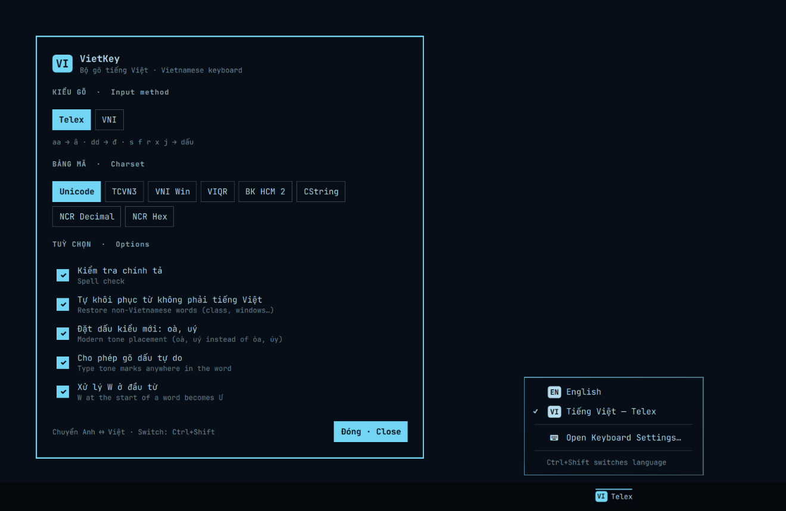

# Keymarchy

**Type in any language on Omarchy.** English and Vietnamese out of the box;
Japanese, Korean, Chinese, Thai, Arabic, Russian and more when you want them.
One badge on the bar, **Ctrl+Shift** (or a key you pick) to cycle, one small dashboard to manage
it all.



Keymarchy is a front end for [fcitx5](https://fcitx-im.org/), the input
method framework Omarchy already runs. It installs engines, keeps your fcitx5
group tidy, and never runs `sudo` itself.

> Formerly **VietKey** (briefly **Omakey** in 2.0.0). The plugin id is still
> `sonlndv.vietkey`, so existing installs upgrade in place — see
> [Upgrading from VietKey](#upgrading-from-vietkey).

## Quick start

```sh
omarchy plugin add https://github.com/sonlndv/omarchy-vietkey.git --enable
~/.config/omarchy/plugins/sonlndv.vietkey/bin/keymarchy-setup
```

That's it. `keymarchy-setup` sets up English + Vietnamese (Telex):

1. installs only the packages you're missing, via `omarchy-pkg-add` (it asks
   for your password; Keymarchy itself never runs sudo);
2. appends the engines to your fcitx5 group over D-Bus — nothing already
   there is reordered or removed;
3. on a first install only: one input state for every window, and fcitx5's
   lone-Shift switching turned off;
4. writes default Unikey options (Telex, Unicode) if you have none;
5. adds the **Ctrl+Shift** binding to `~/.config/hypr/bindings.lua`, inside a
   `-- keymarchy:start` … `-- keymarchy:end` block.

If a new engine needs fcitx5 to restart, Keymarchy says so and **asks first**.
Save your work: open apps may need refocusing afterwards. Say no and nothing
is lost — run it again later to finish.

### Pick the switch key and CapsLock

Prefer another key, or want CapsLock to be a plain Caps Lock? Pass them once;
later runs (including **Add language…** from the menu) keep them:

```sh
keymarchy-setup --key alt+z            # any Hyprland combo: super+space, ctrl+alt+k…
keymarchy-setup --key ctrl+shift       # back to the default
keymarchy-setup --capslock normal      # CapsLock = Caps Lock (drops Omarchy's compose:caps)
keymarchy-setup --capslock compose     # back to Omarchy's Compose key
```

Both live in the same `-- keymarchy:start` … `-- keymarchy:end` block, so
`--uninstall` removes them too. The menu and Settings name your key.

Every file it touches is backed up as `<file>.bak.<date-time>`. See the plan
without changing anything:

```sh
keymarchy-setup --dry-run
```

## Everyday use

| Action                | Effect                                                   |
| --------------------- | -------------------------------------------------------- |
| **Ctrl+Shift**        | Next language in order, wrapping to English after the last |
| Right-click the badge | Same as Ctrl+Shift                                       |
| Click the badge       | Menu: jump to any language, add/remove, open Settings    |

Ctrl+Shift cycles through every language you've enabled, in the order shown
in the menu (your fcitx5 group order, English first):

- **English only** — Ctrl+Shift does nothing; add a language first.
- **Two languages** — flips between them: English ↔ Vietnamese.
- **Three or more** — steps and wraps: English → Vietnamese → Japanese → English.

It fires on key *release*, and only if you pressed nothing else, so
Ctrl+Shift+T and friends keep working.

### The badge

Shows the language code — `EN`, `VI`, `JA`, `AR`… — in your theme's accent
colour when it isn't English, with the mode beside it where it matters:
`Telex` / `VNI` for Vietnamese, `Pinyin` / `Zhuyin` for Chinese.

It updates immediately when you switch with Keymarchy or Ctrl+Shift and on
every window-focus change. A slow fallback check (`fallbackRefreshMs`, 2 s)
only catches switches made with fcitx5's own hotkeys, which emit no event.

### The menu

```
 ✓ [EN] English
   [VI] Tiếng Việt · Telex
   [JA] 日本語 · Mozc
 ──────────────────────────────
   󰐕 Add language…
   󰍴 Remove language…
   󰒓 Keymarchy Settings…
 ──────────────────────────────
   Ctrl+Shift cycles: EN → VI → JA → EN
```

One row per language. Click a row to switch. The active row shows its mode
inline; changing the mode (Telex vs VNI, Mozc vs Anthy) lives in **Keymarchy
Settings…**. Arrow keys or `j`/`k`, Enter and Esc all work.

## Languages

Click the badge → **Add language…** (or **Set up languages…** while you only
have English). English is always on; Vietnamese is pre-ticked; tick anything
else. **Install and add** opens Omarchy's floating terminal and runs the
install so you can watch it and answer the restart question. By hand:

```sh
keymarchy-setup --add ja,ko        # ids from the table below
keymarchy-setup --remove mozc      # drop an engine; the package stays
```

| Language                     | id        | Badge | Package                 | fcitx5 engine  |
| ---------------------------- | --------- | ----- | ----------------------- | -------------- |
| English                      | `en`      | `EN`  | built in                | `keyboard-us`  |
| Vietnamese (Telex / VNI)     | `vi`      | `VI`  | `fcitx5-unikey`         | `unikey`       |
| Japanese                     | `ja`      | `JA`  | `fcitx5-mozc`           | `mozc`         |
| Korean                       | `ko`      | `KO`  | `fcitx5-hangul`         | `hangul`       |
| Chinese Simplified (Pinyin)  | `zh-Hans` | `ZH`  | `fcitx5-chinese-addons` | `pinyin`       |
| Chinese Traditional (Zhuyin) | `zh-Hant` | `ZH`  | `fcitx5-chewing`        | `chewing`      |
| Thai                         | `th`      | `TH`  | `fcitx5-libthai`        | `libthai`      |
| Thai (keyboard layout)       | `th-kbd`  | `TH`  | none — keyboard layout  | `keyboard-th`  |
| Arabic                       | `ar-kbd`  | `AR`  | none — keyboard layout  | `keyboard-ara` |
| Persian                      | `fa-kbd`  | `FA`  | none — keyboard layout  | `keyboard-ir`  |
| Hebrew                       | `he-kbd`  | `HE`  | none — keyboard layout  | `keyboard-il`  |
| Russian                      | `ru-kbd`  | `RU`  | none — keyboard layout  | `keyboard-ru`  |
| Ukrainian                    | `uk-kbd`  | `UK`  | none — keyboard layout  | `keyboard-ua`  |
| Greek                        | `el-kbd`  | `EL`  | none — keyboard layout  | `keyboard-gr`  |
| Hindi                        | `hi-kbd`  | `HI`  | none — keyboard layout  | `keyboard-in`  |
| Anything else                | `other`   | code  | `fcitx5-m17n`           | from fcitx5's m17n list |

Keyboard-layout languages need no package and no fcitx5 restart. For
**Anything else**, Keymarchy installs `fcitx5-m17n`; pick the engine in
`fcitx5-configtool` and Keymarchy shows it with a badge from its language
code. Engines you added yourself (Anthy, Shuangpin, …) appear under their
language too.

## Keymarchy Settings

**Keymarchy Settings…** in the menu, or `omarchy-shell sonlndv.vietkey settings`.
Changes apply straight away.

- **Languages** (left) — your languages in Ctrl+Shift order. **↑/↓** reorder
  (English stays first). **󰍴** removes from the group; packages stay.
  **Add language…** opens the picker.
- **Options** (right), for the selected language:
  - Vietnamese — the Unikey page below.
  - A language with several engines in your group (Mozc + Anthy, Pinyin +
    Shuangpin) — pick the engine.
  - Other engines — a link to `fcitx5-configtool`.
  - Keyboard layouts — nothing to set.
- **General** (bottom) — the cycle order, and whether the mode shows beside
  the badge.

Keys: ↑/↓ select, Ctrl+↑/↓ move, Enter switch, Delete remove, Tab or → to
options, Esc close.

### Vietnamese (Unikey)

- **Kiểu gõ · Input method:** Telex or VNI
- **Bảng mã · Charset:** Unicode (default), TCVN3, VNI Win, VIQR, BK HCM 2,
  CString, NCR Decimal, NCR Hex
- **Tuỳ chọn · Options:** spell check · auto-restore non-Vietnamese words
  (`class`, `windows` stay as typed) · modern tone placement (oà, uý) · free
  tone-mark position · W at word start → Ư

**Telex**

| Keys           | Result | Keys | Result          |
| -------------- | ------ | ---- | --------------- |
| `aa` `ee` `oo` | â ê ô  | `s`  | sắc (á)         |
| `aw`           | ă      | `f`  | huyền (à)       |
| `ow` `uw` `w`  | ơ ư    | `r`  | hỏi (ả)         |
| `dd`           | đ      | `x`  | ngã (ã)         |
|                |        | `j`  | nặng (ạ)        |
|                |        | `z`  | remove the mark |

**VNI**

| Keys           | Result | Keys | Result          |
| -------------- | ------ | ---- | --------------- |
| `a6` `e6` `o6` | â ê ô  | `1`  | sắc             |
| `a8`           | ă      | `2`  | huyền           |
| `o7` `u7`      | ơ ư    | `3`  | hỏi             |
| `d9`           | đ      | `4`  | ngã             |
|                |        | `5`  | nặng            |
|                |        | `0`  | remove the mark |

## Upgrading from VietKey

Same plugin id, so it's an update, not a remove and re-add:

```sh
omarchy plugin update sonlndv.vietkey
~/.config/omarchy/plugins/sonlndv.vietkey/bin/keymarchy-setup
```

`keymarchy-setup` finds the old `-- vietkey:start/end` (or 2.0.0's
`-- omakey:start/end`) block in `~/.config/hypr/bindings.lua` and replaces it
with `-- keymarchy:start/end`, backing the file up first. Your Unikey settings
and fcitx5 group are untouched. `--dry-run` shows the exact change.

Until you run it, the old binding still works — it calls `fcitx5-remote -t`
directly, so it toggles two languages rather than cycling all of them.
The old `bin/vietkey-setup` and `bin/omakey-setup` names are gone as of 2.0.3;
`keymarchy-setup` is the one setup script.

## Commands and options

The plugin is addressed by its id, `sonlndv.vietkey`:

```sh
omarchy-shell sonlndv.vietkey toggle          # next language (what Ctrl+Shift runs)
omarchy-shell sonlndv.vietkey english
omarchy-shell sonlndv.vietkey setLanguage ja  # vi ja ko zh-Hans zh-Hant th …
omarchy-shell sonlndv.vietkey setMode VNI     # Vietnamese: VNI or Telex
omarchy-shell sonlndv.vietkey addLanguage     # open the picker
omarchy-shell sonlndv.vietkey togglePanel     # open / close the menu
omarchy-shell sonlndv.vietkey settings        # open / close Settings

omarchy bar move sonlndv.vietkey --section right
omarchy bar set sonlndv.vietkey showModeName false --json        # badge only
omarchy bar set sonlndv.vietkey fallbackRefreshMs 15000 --json   # slower fallback
```

## Troubleshooting

- **Nothing changes when I type** — check fcitx5 is running
  (`systemctl --user status omarchy-fcitx5`); the badge dims when it isn't.
  Then run `keymarchy-setup` again.
- **Ctrl+Shift does nothing** — confirm the `-- keymarchy:start` block is in
  `~/.config/hypr/bindings.lua`, then `hyprctl reload`.
- **A language I added doesn't show up** — fcitx5 needs the restart you
  declined. `keymarchy-setup --add <id>` again and answer yes.
- **Badge lags after using fcitx5's own hotkey** — that's the fallback check.
  Use Ctrl+Shift or the menu, or lower `fallbackRefreshMs`.
- **An Electron app (VS Code, Discord, Slack) types badly** — start it with
  `--enable-wayland-ime`.

## Uninstall

```sh
~/.config/omarchy/plugins/sonlndv.vietkey/bin/keymarchy-setup --uninstall
omarchy plugin remove sonlndv.vietkey
```

`--uninstall` removes the Ctrl+Shift block from `bindings.lua` (with a
backup). Packages and your fcitx5 group are left alone; use
`fcitx5-configtool` and `pacman` if you want them gone.

## Requirements

Omarchy 4 (Hyprland + Omarchy shell) with fcitx5 run by the `omarchy-fcitx5`
user service. `busctl` and `jq` for live state, `hyprctl` for focus events,
`omarchy-pkg-add` and Omarchy's floating terminal for installs. Packages come
from the Arch `extra` repo. `fcitx5-configtool` is optional.

## Development

```
BarWidget.qml        bar badge, menu, language picker        (Quickshell / QML)
SettingsWindow.qml   the Settings dashboard
Catalogue.mjs        language catalogue + all pure logic      (no Qt; shared with tests)
bin/keymarchy-setup  install engines, edit group, bind Ctrl+Shift   (bash)
bin/keymarchy-state  read-only: current IM + group, via busctl --json + jq
```

```sh
npm test        # catalogue logic; also fails if the bash copy of the catalogue drifts
npm run lint    # qmllint (errors only) + shellcheck
npm run test:e2e                      # headless typing test, every language
python3 test/bench-keymarchy-state.py # state-read latency, 10 runs, median
```

Rules the code keeps: never `sudo`; never reorder or remove a user's fcitx5
group entries; never restart fcitx5 without asking; back up every file before
editing it.

## Changelog

- **2.0.4** — README: Thai keyboard-layout row (`th-kbd`) was missing from
  the languages table.
- **2.0.3** — One setup script: `bin/vietkey-setup` and `bin/omakey-setup`
  shims removed.
- **2.0.2** — `keymarchy-state` reads fcitx5 via `busctl --json` + `jq`, so
  group and engine names containing quotes parse correctly. Fallback refresh
  default 5 s → 2 s. `npm run lint`.
- **2.0.1** — Renamed Omakey → Keymarchy.
- **2.0.0** — Multi-language: catalogue, picker, Ctrl+Shift cycles all
  languages, Settings dashboard, keyboard-layout languages.
- **1.x** — VietKey: English / Telex / VNI.

## Credits

Multi-language design (badge with mode, append-only group changes,
ask-before-restart, no polling) inspired by
[ray0907/input-menu](https://github.com/Ray0907/omarchy-input-menu) (MIT).
Menu design follows
[jesusarchive/omarchy-keyboard-layout-switcher](https://github.com/jesusarchive/omarchy-keyboard-layout-switcher) (MIT).
Vietnamese input by [fcitx5-unikey](https://github.com/fcitx/fcitx5-unikey).

## License

MIT
